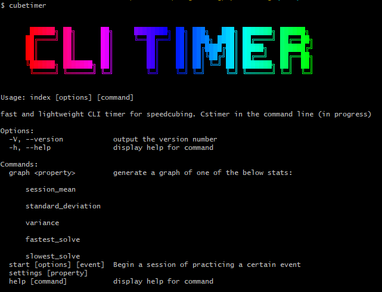

# 🧩 CubeTimer


A **fast and lightweight CLI timer** for speedcubing. Generate random scrambles and track your solves and analyze your times.

## 🚀 Features
 - ✅ Accurate Timer – Supports stackmat, spacebar, and mouse click timing.
 - ✅ Scramble Generator – Provides scrambles for 2x2-7x7, Megaminx, Pyraminx, Skewb, Square-1, and Clock.
 - ✅ Session Statistics – Tracks mean, average of 5/12, best/worst times, and standard deviation.




## 📦 Installation

### **Prerequisites**
- Requires **Node.js v16+**.

### **Install via npm**
```sh
npm install -g @dilapidated-penguin/cubetimer
```

### **Run in Local Development**
```sh
git clone https://github.com/Dilapidated-Penguin/speedcubing-timer-cli.git
cd cubetimer
npm install
npm start
```

## 🎯 Usage

### **Start a Timer**
```sh
cubetimer start
```
Hold down the **spacebar** to prime the timer, release it to start and tap the **spacebar** again to stop the timer

### **Change settings**
```sh
cubetimer settings
```

## 🔨 Development
### **Build TypeScript**
```sh
npm run build
```

## 🛠️ Dependencies
- [`@futpib/node-global-key-listener`](https://www.npmjs.com/package/@futpib/node-global-key-listener) – Global key listening for timing functionality.
- [`chalk`](https://www.npmjs.com/package/chalk) – Terminal styling.
- [`keypress`](https://www.npmjs.com/package/keypress) – Key event handling.
- [`scrambow`](https://www.npmjs.com/package/scrambow) 
    – Scrambow is used for scramble generation and so the question of whether this cli supports an event is implicitly the question of whether scrambow supports the event.
- [`nice-table`](https://www.npmjs.com/package/nice-table) - for rendering tables in the console with a clean and structured format.
- [cfonts](https://www.npmjs.com/package/cfonts) - ANSI fonts
## Known Issues
🔴 Key listening continues to listen when the window is out of focus
Description: Key listener used in the timer will continue to the key events even when user is in another window
Status: ⏳ Work in Progress
## 📜 License
This project is licensed under the **MIT License**.

---
🚧 **Note:** This project is very much still in development. Expect updates and new features! 🚀

